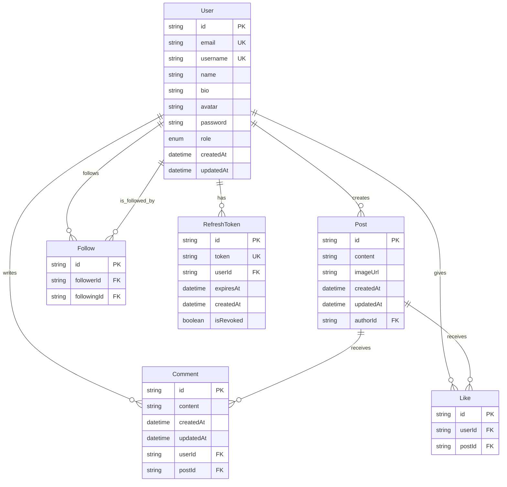

# Database Entity Relationship Diagram (ERD)

## Overview
This document provides a comprehensive overview of the database schema for the Social Media Application. The database is built using PostgreSQL with Prisma ORM.

## Database Schema Diagram

## Entity Descriptions

### 1. User
The core entity representing application users.

**Fields:**
- `id` (String, PK): Unique identifier using CUID
- `email` (String, UK): User's email address (unique)
- `username` (String, UK): User's chosen username (unique)
- `name` (String): User's display name
- `bio` (String, Optional): User's biography/description
- `avatar` (String, Optional): URL to user's profile picture
- `password` (String): Hashed password for authentication
- `role` (UserRole): User's role in the system (USER/ADMIN)
- `createdAt` (DateTime): Account creation timestamp
- `updatedAt` (DateTime): Last update timestamp

**Relationships:**
- One-to-Many with Post (User creates Posts)
- One-to-Many with Comment (User writes Comments)
- One-to-Many with Like (User gives Likes)
- One-to-Many with RefreshToken (User has RefreshTokens)
- Many-to-Many with User through Follow (followers/following)

### 2. Post
Represents user-created content posts.

**Fields:**
- `id` (String, PK): Unique identifier using CUID
- `content` (String): Text content of the post
- `imageUrl` (String, Optional): URL to attached image
- `createdAt` (DateTime): Post creation timestamp
- `updatedAt` (DateTime): Last update timestamp
- `authorId` (String, FK): Reference to the User who created the post

**Relationships:**
- Many-to-One with User (Post belongs to User)
- One-to-Many with Comment (Post receives Comments)
- One-to-Many with Like (Post receives Likes)

### 3. Comment
Represents comments on posts.

**Fields:**
- `id` (String, PK): Unique identifier using CUID
- `content` (String): Text content of the comment
- `createdAt` (DateTime): Comment creation timestamp
- `updatedAt` (DateTime): Last update timestamp
- `userId` (String, FK): Reference to the User who wrote the comment
- `postId` (String, FK): Reference to the Post being commented on

**Relationships:**
- Many-to-One with User (Comment belongs to User)
- Many-to-One with Post (Comment belongs to Post)

### 4. Like
Represents user likes on posts.

**Fields:**
- `id` (String, PK): Unique identifier using CUID
- `userId` (String, FK): Reference to the User who gave the like
- `postId` (String, FK): Reference to the Post being liked

**Relationships:**
- Many-to-One with User (Like belongs to User)
- Many-to-One with Post (Like belongs to Post)

**Constraints:**
- Unique constraint on `[userId, postId]` prevents duplicate likes

### 5. Follow
Represents follow relationships between users.

**Fields:**
- `id` (String, PK): Unique identifier using CUID
- `followerId` (String, FK): Reference to the User who is following
- `followingId` (String, FK): Reference to the User being followed

**Relationships:**
- Many-to-One with User (Follow belongs to Follower)
- Many-to-One with User (Follow belongs to Following)

**Constraints:**
- Unique constraint on `[followerId, followingId]` prevents duplicate follows

### 6. RefreshToken
Manages user authentication refresh tokens.

**Fields:**
- `id` (String, PK): Unique identifier using CUID
- `token` (String, UK): The refresh token string (unique)
- `userId` (String, FK): Reference to the User who owns the token
- `expiresAt` (DateTime): Token expiration timestamp
- `createdAt` (DateTime): Token creation timestamp
- `isRevoked` (Boolean): Whether the token has been revoked

**Relationships:**
- Many-to-One with User (RefreshToken belongs to User)

## Enums

### UserRole
- `USER`: Standard user role
- `ADMIN`: Administrator role with elevated privileges

## Database Constraints

### Primary Keys
- All entities use `id` field as primary key with CUID generation

### Foreign Keys
- All foreign key relationships use CASCADE delete for referential integrity
- Foreign keys are properly indexed for performance

### Unique Constraints
- User email and username are unique
- Like combinations of userId and postId are unique
- Follow combinations of followerId and followingId are unique
- RefreshToken token is unique

### Database Mapping
- All tables use snake_case naming convention via `@@map` directives
- Tables: `users`, `posts`, `comments`, `likes`, `follows`, `refresh_tokens`

## Indexing Strategy

**Recommended Indexes:**
- Primary keys (automatically indexed)
- Foreign keys (for join performance)
- Unique constraints (automatically indexed)
- Consider adding indexes on:
  - `User.createdAt` (for user listing by registration date)
  - `Post.createdAt` (for post listing by creation date)
  - `Post.authorId` (for user's posts queries)
  - `Comment.postId` (for post comments queries)
  - `Like.postId` (for post likes count queries)

## Data Integrity Rules

1. **Cascade Deletes:**
   - Deleting a User cascades to delete their Posts, Comments, Likes, Follows, and RefreshTokens
   - Deleting a Post cascades to delete its Comments and Likes

2. **Referential Integrity:**
   - All foreign key relationships are enforced at the database level
   - No orphaned records can exist

3. **Business Rules:**
   - Users cannot like the same post multiple times
   - Users cannot follow the same person multiple times
   - Refresh tokens have expiration dates and can be revoked

## Performance Considerations

1. **Query Optimization:**
   - Use appropriate indexes for common query patterns
   - Consider pagination for large result sets (posts, comments, followers)

2. **Scalability:**
   - CUID generation provides distributed ID generation
   - Timestamp fields enable efficient time-based queries
   - Soft delete patterns can be implemented using status fields

## Security Considerations

1. **Authentication:**
   - Passwords are hashed (not stored in plain text)
   - Refresh tokens have expiration and revocation capabilities

2. **Authorization:**
   - Role-based access control via UserRole enum
   - Users can only modify their own content

3. **Data Privacy:**
   - Consider implementing soft deletes for user data
   - Audit trails can be added using the existing timestamp fields 