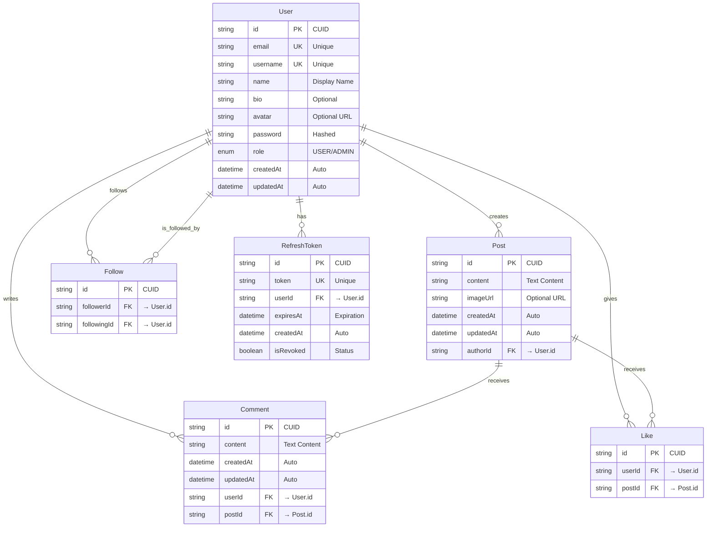
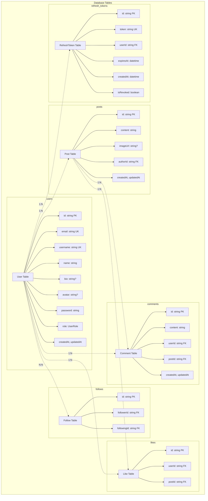

# Database ERD - Visual Diagram

## Entity Relationship Diagram

## Alternative View: Database Tables Layout

## Database Schema Summary

### Core Entities
1. **User** - Central entity for user accounts and profiles
2. **Post** - User-generated content posts
3. **Comment** - User comments on posts
4. **Like** - User reactions to posts
5. **Follow** - User-to-user follow relationships
6. **RefreshToken** - Authentication token management

### Key Relationships
- **User → Post**: One-to-Many (User creates multiple posts)
- **User → Comment**: One-to-Many (User writes multiple comments)
- **User → Like**: One-to-Many (User gives multiple likes)
- **Post → Comment**: One-to-Many (Post receives multiple comments)
- **Post → Like**: One-to-Many (Post receives multiple likes)
- **User ↔ User**: Many-to-Many through Follow (followers/following)

### Database Features
- **Primary Keys**: All tables use CUID strings
- **Foreign Keys**: Proper referential integrity with CASCADE deletes
- **Unique Constraints**: Email, username, like combinations, follow combinations
- **Timestamps**: Automatic creation and update tracking
- **Naming**: Snake_case table names via Prisma mapping

### Performance Notes
- All foreign keys are automatically indexed
- Unique constraints provide additional indexing
- Consider adding indexes on frequently queried timestamp fields
- CUID generation supports distributed systems 