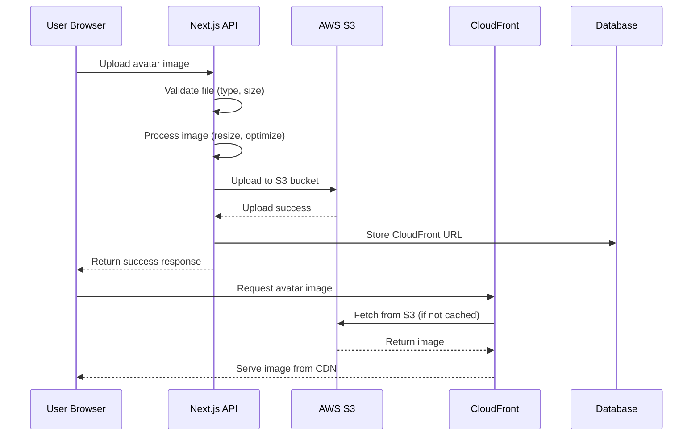

# AWS Avatar System Architecture

## 🏗️ System Overview

```
┌─────────────────┐    ┌─────────────────┐    ┌─────────────────┐    ┌─────────────────┐
│   User Browser  │    │   Next.js App   │    │   AWS S3        │    │   CloudFront    │
│                 │    │   (Backend)     │    │   (Storage)     │    │   (CDN)         │
└─────────────────┘    └─────────────────┘    └─────────────────┘    └─────────────────┘
```

## 🔄 Upload Flow



## 🗂️ File Structure

```
AWS S3 Bucket: davesocialmediaapp
├── avatars/
│   ├── avatar_userId_timestamp_uuid.jpg
│   ├── avatar_userId_timestamp_uuid.jpg
│   └── ...
```

## 🔐 Security Architecture

```
┌─────────────────────────────────────────────────────────────────┐
│                        AWS IAM                                 │
├─────────────────────────────────────────────────────────────────┤
│ User: S3AvatarAccess                                           │
│ ├── Policy: AmazonS3FullAccess                                 │
│ └── Credentials: Access Key + Secret Key                       │
└─────────────────────────────────────────────────────────────────┘

┌─────────────────────────────────────────────────────────────────┐
│                    S3 Bucket Policy                            │
├─────────────────────────────────────────────────────────────────┤
│ Allow: cloudfront.amazonaws.com                                │
│ Action: s3:GetObject                                           │
│ Resource: arn:aws:s3:::davesocialmediaapp/*                    │
│ Condition: AWS:SourceArn = CloudFront Distribution ARN         │
└─────────────────────────────────────────────────────────────────┘

┌─────────────────────────────────────────────────────────────────┐
│                  CloudFront Distribution                       │
├─────────────────────────────────────────────────────────────────┤
│ Origin: S3 Bucket (davesocialmediaapp)                        │
│ Origin Path: /avatars                                          │
│ Origin Access Control: Enabled                                 │
│ Viewer Protocol Policy: Redirect HTTP to HTTPS                 │
│ Cache Policy: CachingOptimized                                 │
└─────────────────────────────────────────────────────────────────┘
```

## 🌐 URL Flow

```
1. User uploads: POST /api/users/me/avatar
2. File processed: Sharp (resize, optimize, strip EXIF)
3. S3 upload: s3://davesocialmediaapp/avatars/filename.jpg
4. Database stores: https://d1ch3lpsf2hczd.cloudfront.net/avatars/filename.jpg
5. User requests: https://d1ch3lpsf2hczd.cloudfront.net/avatars/filename.jpg
6. CloudFront serves: From cache or fetches from S3
```

## 📊 Performance Benefits

```
┌─────────────────────────────────────────────────────────────────┐
│                    Performance Metrics                         │
├─────────────────────────────────────────────────────────────────┤
│ ✅ Global CDN: 200+ edge locations worldwide                   │
│ ✅ Caching: 1 year cache headers                               │
│ ✅ Compression: Automatic gzip compression                     │
│ ✅ HTTPS: TLS 1.2+ encryption                                  │
│ ✅ Availability: 99.9% uptime SLA                              │
│ ✅ Latency: < 100ms for cached content                         │
└─────────────────────────────────────────────────────────────────┘
```

## 🔧 Configuration Details

### Environment Variables
```env
AWS_REGION=us-east-2
AWS_ACCESS_KEY_ID=your-access-key
AWS_SECRET_ACCESS_KEY=your-secret-key
AWS_S3_BUCKET_NAME=davesocialmediaapp
CLOUDFRONT_DOMAIN=d1ch3lpsf2hczd.cloudfront.net
```

### S3 Upload Configuration
```typescript
{
  Bucket: "davesocialmediaapp",
  Key: "avatars/filename.jpg",
  ContentType: "image/jpeg",
  CacheControl: "public, max-age=31536000",
  ContentDisposition: "inline"
}
```

### CloudFront Settings
- **Distribution**: CloudfrontAvatar
- **Origin**: davesocialmediaapp.s3.us-east-2.amazonaws.com
- **Origin Path**: /avatars
- **Viewer Protocol**: Redirect HTTP to HTTPS
- **Cache Policy**: CachingOptimized
- **Origin Access Control**: Enabled

## 🛡️ Security Features

```
┌─────────────────────────────────────────────────────────────────┐
│                        Security Layers                         │
├─────────────────────────────────────────────────────────────────┤
│ 🔒 S3 Bucket: ACLs disabled (secure by default)                │
│ 🔒 IAM: Least privilege access (S3FullAccess)                  │
│ 🔒 CloudFront: Origin Access Control (OAC)                     │
│ 🔒 HTTPS: TLS encryption for all requests                      │
│ 🔒 CORS: Configured for frontend domain                        │
│ 🔒 File Validation: Type, size, and content validation         │
└─────────────────────────────────────────────────────────────────┘
```

## 💰 Cost Optimization

```
┌─────────────────────────────────────────────────────────────────┐
│                        Cost Structure                          │
├─────────────────────────────────────────────────────────────────┤
│ 💵 S3 Storage: $0.023 per GB/month                             │
│ 💵 S3 Requests: $0.0004 per 1,000 PUT requests                 │
│ 💵 CloudFront: $0.085 per GB transferred                       │
│ 💵 CloudFront Requests: $0.0075 per 10,000 requests            │
│ 💵 Estimated Monthly Cost: < $5 for typical usage              │
└─────────────────────────────────────────────────────────────────┘
```

## 🚀 Benefits Summary

- **Scalability**: No local storage limitations
- **Performance**: Global CDN with edge caching
- **Security**: AWS security best practices
- **Reliability**: 99.9% availability SLA
- **Cost-effective**: Pay-per-use pricing
- **Maintenance**: Fully managed AWS services